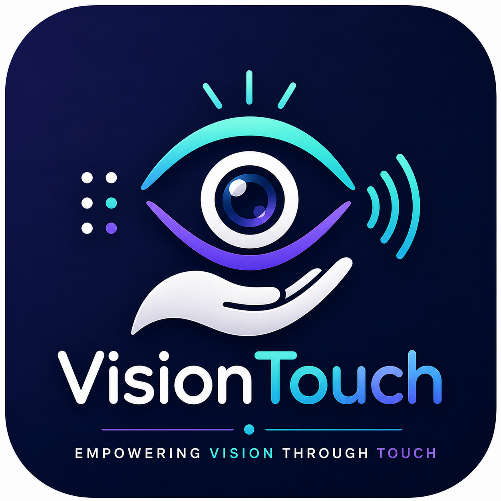
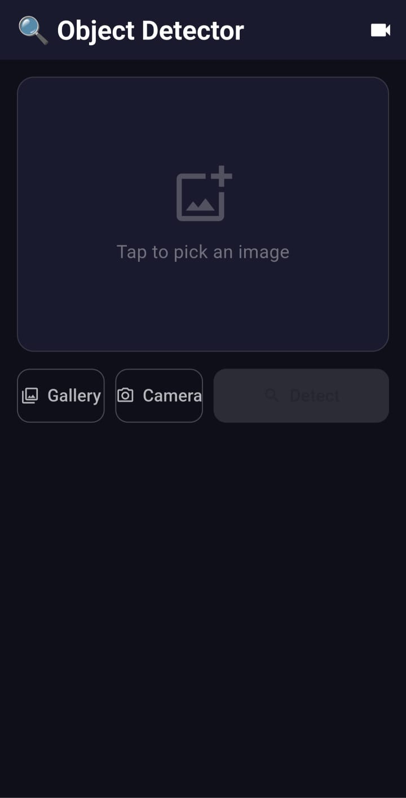
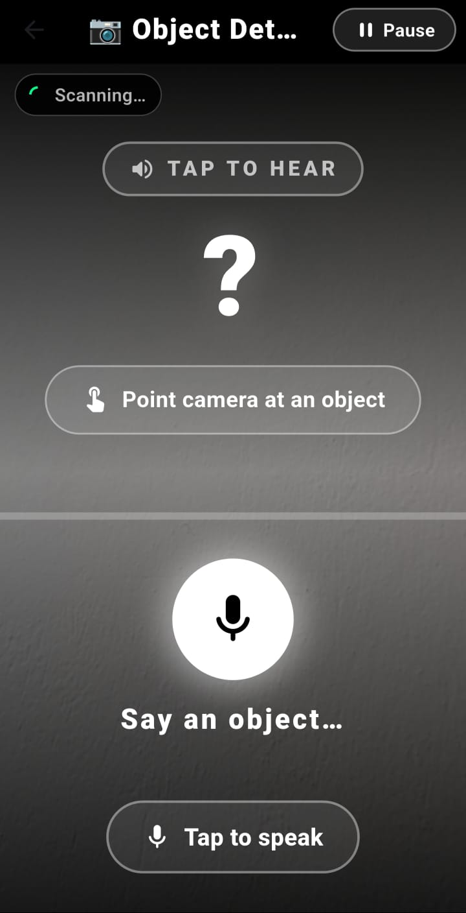
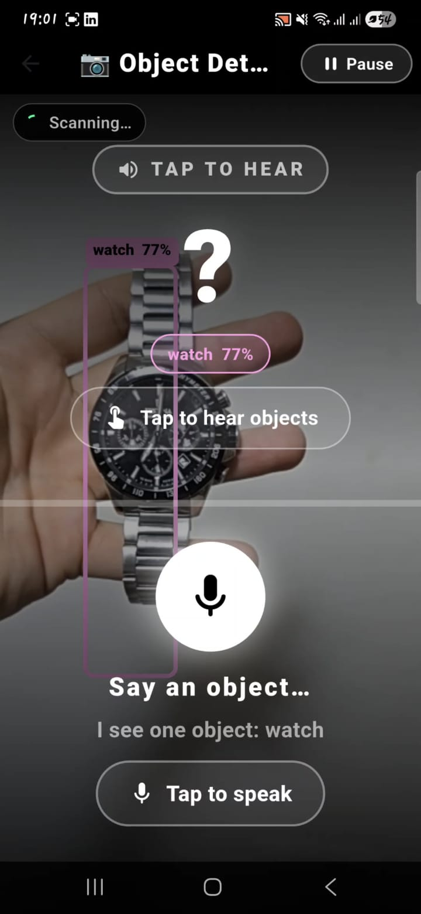
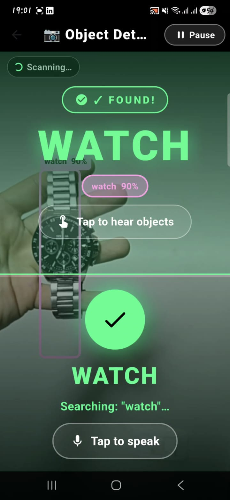
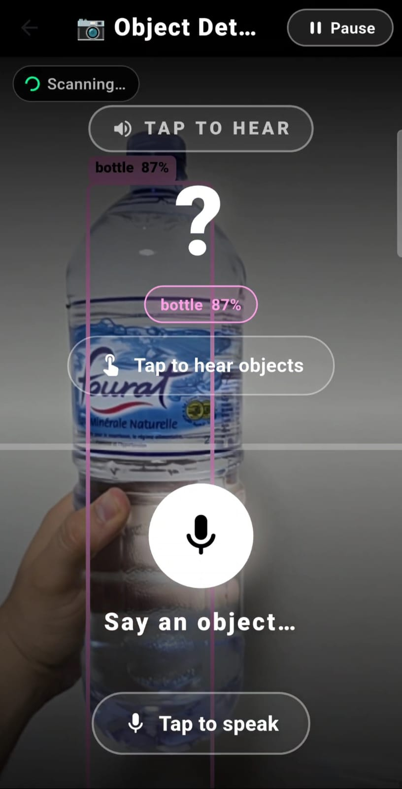
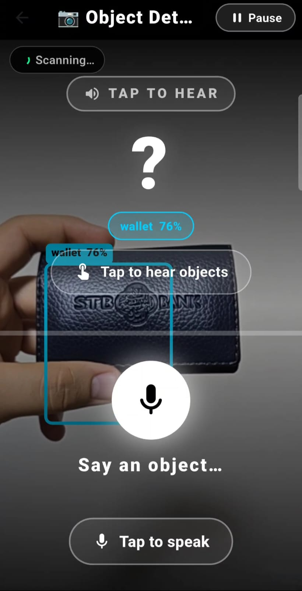

# 👁️ VisionTouch - Object Detection App

**Une application complète de détection d'objets en temps réel pour assister les personnes aveugles et malvoyantes.**



---

## 📋 Table des matières

- [Aperçu du projet](#aperçu-du-projet)
- [Architecture du projet](#architecture-du-projet)
- [Prérequis](#prérequis)
- [Installation et Lancement](#installation-et-lancement)
- [Structure des dossiers](#structure-des-dossiers)
- [Captures d'interface](#captures-dinterface)
- [Technologies utilisées](#technologies-utilisées)
- [Endpoints API](#endpoints-api)
- [Auteurs](#auteurs)

---

## 📱 Aperçu du projet

**VisionTouch** est une application innovante qui combine :

- **🤖 Backend IA** : Détection d'objets en temps réel avec YOLOv8 (entraîné sur 30 classes)
- **📱 Frontend Mobile** : Application Flutter cross-platform (Android, iOS, Web)
- **🎤 Accessibilité** : Synthèse vocale (TTS) pour annoncer les objets détectés
- **📸 Multi-capture** : Capture en temps réel via caméra ou galerie
- **⚡ Performance** : API REST optimisée pour les requêtes rapides

---

## 🏗️ Architecture du projet

```
VisionTouch/
│
├── backend/                          # API Flask + YOLOv8
│   ├── app.py                       # Application Flask principale
│   ├── model/
│   │   └── best.pt                  # Modèle YOLO entraîné (30 classes)
│   ├── routes/
│   │   └── detection.py             # Endpoints de détection
│   ├── services/
│   │   └── detector.py              # Logique YOLOv8
│   ├── requirements.txt             # Dépendances Python
│   └── .env                         # Variables d'environnement
│
├── front_detection/                  # Application Flutter
│   ├── lib/
│   │   ├── main.dart                # Point d'entrée
│   │   ├── app/
│   │   │   ├── data/                # Services API
│   │   │   ├── models/              # Modèles de données
│   │   │   ├── modules/             # Pages de l'app
│   │   │   └── routes/              # Navigation
│   │   └── ...
│   ├── pubspec.yaml                 # Dépendances Dart/Flutter
│   ├── android/                     # Configuration Android
│   └── ios/                         # Configuration iOS
│
├── Capture/                          # Screenshots et ressources
│   ├── interface_*.png              # Captures des écrans
│   └── logo.png                     # Logo du projet
│
└── README.md                         # Ce fichier
```

---

## 🚀 Installation et Lancement

### Prérequis

#### Pour le Backend :
- Python 3.8+
- pip (gestionnaire de paquets Python)
- Modèle YOLO pré-entraîné (`best.pt`)

#### Pour le Frontend :
- Flutter SDK 3.8+
- Android SDK (pour tester sur Android)
- IDE : VS Code ou Android Studio

### Étape 1 : Cloner le repository

```bash
git clone https://github.com/ahmed-hamda/VisionTouch.git
cd VisionTouch
```

### Étape 2 : Configuration du Backend

#### 2.1 Créer et activer un environnement virtuel Python

```bash
cd backend
python -m venv .venv

# Windows
.venv\Scripts\activate

# Linux/Mac
source .venv/bin/activate
```

#### 2.2 Installer les dépendances

```bash
pip install -r requirements.txt
```

#### 2.3 Lancer le serveur Flask

```bash
python app.py
```

**Résultat attendu :**
```
[OK] YOLO loaded: model/best.pt
 * Running on http://127.0.0.1:5000
 * Running on http://192.168.1.X:5000
```

Le backend sera accessible sur **`http://192.168.1.X:5000`** (remplacez X par votre IP locale)

---

### Étape 3 : Configuration du Frontend

#### 3.1 Accéder au dossier Flutter

```bash
cd front_detection
```

#### 3.2 Récupérer les dépendances

```bash
flutter pub get
```

#### 3.3 Configurer l'URL du backend

Éditez `lib/app/data/detection_service.dart` et mettez à jour l'URL :

```dart
static const String _baseUrl = 'http://192.168.1.X:5000/api';  // Remplacez X par votre IP
```

#### 3.4 Lancer l'app sur votre téléphone

**Pour Android :**
```bash
flutter run --device-id <device_id>
```

**Pour obtenir l'ID du device :**
```bash
flutter devices
```

**Exemple :**
```bash
flutter run --device-id xxxxxxxxxxxx
```

---

## 📁 Structure des dossiers détaillée

### Backend (`backend/`)

| Fichier | Description |
|---------|-------------|
| `app.py` | Application Flask principale, configuration CORS, chargement du modèle YOLO |
| `requirements.txt` | Dépendances Python (Flask, YOLOv8, OpenCV, etc.) |
| `routes/detection.py` | Endpoint `/api/detect` pour la détection d'objets |
| `services/detector.py` | Classe `YoloDetector` - logique de détection avec YOLOv8 |
| `model/best.pt` | Modèle YOLO pré-entraîné sur 30 classes d'objets |

### Frontend (`front_detection/`)

| Dossier | Description |
|---------|-------------|
| `lib/app/data/` | Services API (`detection_service.dart`, `api_provider.dart`) |
| `lib/app/models/` | Modèles de données (`detection_result.dart`) |
| `lib/app/modules/` | Pages de l'app (Home, Detection, Realtime) |
| `lib/app/routes/` | Navigation et routing |
| `android/` | Configuration Android (SDK, NDK, permissions) |
| `pubspec.yaml` | Dépendances Flutter/Dart |

### Ressources (`Capture/`)

| Contenu | Description |
|---------|-------------|
| `interface_*.png` | Screenshots des écrans de l'application |
| `logo.png` | Logo du projet VisionTouch |

---

## 📸 Captures d'interface

Les screenshots de l'application se trouvent dans le dossier `Capture/` :

- **Home Screen** : Écran d'accueil avec options
- **Detection Screen** : Détection à partir de photos
- **Realtime Screen** : Détection en temps réel via caméra
- **Results Screen** : Affichage des objets détectés









---

## 🛠️ Technologies utilisées

### Backend
- **Flask** 3.0.2 - Framework web Python
- **YOLOv8** (Ultralytics 8.2.0) - Détection d'objets IA
- **OpenCV** 4.9.0 - Traitement d'images
- **NumPy** 1.26.4 - Calculs numériques
- **Pillow** 10.2.0 - Manipulation d'images

### Frontend
- **Flutter** 3.8+ - Framework mobile cross-platform
- **Dart** - Langage de programmation
- **GetX** 4.7.3 - Gestion d'état et routing
- **HTTP** 1.1.0 - Requêtes HTTP
- **Camera** 0.10.5 - Accès à la caméra
- **Image Picker** 1.1.2 - Sélection d'images
- **Flutter TTS** 4.2.0 - Synthèse vocale
- **Vibration** 3.1.3 - Feedback haptique

---

## 🔌 Endpoints API

### Détection d'objets

**Endpoint :** `POST /api/detect`

**Description :** Envoie une image pour détection d'objets

**Paramètres :**
- `image` (FormData, obligatoire) : Fichier image (JPG, PNG, WebP)

**Réponse (200 OK) :**
```json
{
  "status": "success",
  "model_info": {
    "model_name": "best.pt",
    "total_classes": 30,
    "conf_threshold": 0.25
  },
  "detections": [
    {
      "class": "person",
      "confidence": 0.95,
      "bbox": [100, 150, 250, 400]
    },
    {
      "class": "car",
      "confidence": 0.87,
      "bbox": [50, 200, 300, 350]
    }
  ],
  "inference_time": 0.234
}
```

**Erreur (400) :**
```json
{
  "error": "Invalid image file"
}
```

---

## 📋 Dépendances complètes

### Python (Backend)

Voir `backend/requirements.txt` :

```
flask==3.0.2
flask-cors==4.0.0
ultralytics==8.2.0
opencv-python==4.9.0.80
Pillow==10.2.0
numpy==1.26.4
gunicorn==21.2.0
torch>=2.0.0
```

### Dart/Flutter (Frontend)

Voir `front_detection/pubspec.yaml` :

```yaml
dependencies:
  flutter: sdk: flutter
  get: ^4.7.3
  camera: ^0.10.5+9
  http: ^1.1.0
  image_picker: ^1.1.2
  flutter_tts: ^4.2.0
  vibration: ^3.1.3
  dotted_border: ^2.1.0
  speech_to_text: ^7.0.0
```

---

## ⚙️ Configuration d'environnement

### Backend (`.env`)

```bash
FLASK_DEBUG=1
PORT=5000
HOST=0.0.0.0
YOLO_MODEL_PATH=model/best.pt
CONF_THRESHOLD=0.25
IMG_SIZE=640
```

### Frontend

Modifiez l'URL de l'API dans `lib/app/data/detection_service.dart` :

```dart
static const String _baseUrl = 'http://<YOUR_PC_IP>:5000/api';
```

---


## 👨‍💼 Auteurs

- **Ahmed Hamda** 
- **Yassine Dhuib** 
- Projet : **VisionTouch**
- Date : 2026


---

## 📄 Licence

Ce projet est un travail académique. Consultez votre établissement pour les conditions d'utilisation.

---


